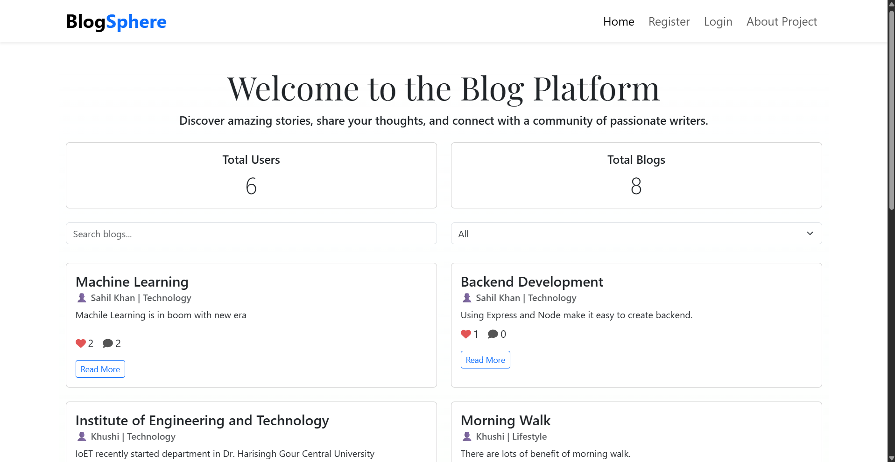

# BlogSphere

**BlogSphere** is a full-stack MERN application that offers a seamless platform for users to create, manage, and explore blog content. Featuring rich text editing, user authentication, nested commenting, and dynamic filtering, it provides a robust and modern blogging experience.



---

## 🚀 Features

* 🔐 **User Authentication** – Register and log in securely using JWT.
* ✍️ **Rich Text Editor** – Create engaging posts with a WYSIWYG editor.
* 📚 **Full Blog CRUD** – Create, read, update, and delete blog posts.
* 💬 **Comment System** – Support for threaded/nested comments and guest interactions.
* ❤️ **Interactive Engagement** – Like and comment on blog posts.
* 🔍 **Dynamic Filtering** – Search and filter blogs by category or keyword.
* 👤 **User Profiles** – View and update profile information.
* 📊 **Admin Dashboard** – View user/blog statistics.
* 📱 **Responsive Design** – Optimized for all screen sizes.

---

## 🛠️ Tech Stack

| Frontend     | Backend           | Database           | Authentication        |
| ------------ | ----------------- | ------------------ | --------------------- |
| React + Vite | Node.js + Express | MongoDB + Mongoose | JWT (JSON Web Tokens) |

> Additional Libraries: React Router, Bootstrap, Axios, ReactQuill

---

## 📦 Project Structure

```
/
├── client/         # Frontend - React
│   ├── src/
│   │   ├── components/
│   │   ├── context/
│   │   ├── pages/
│   │   └── utils/
│   └── package.json
└── server/         # Backend - Express.js
    ├── config/
    ├── middleware/
    ├── models/
    ├── routes/
    ├── index.js
    └── package.json
```

---

## ⚙️ Getting Started

### ✅ Prerequisites

* [Node.js](https://nodejs.org/) (v18 or above)
* [npm](https://www.npmjs.com/)
* [MongoDB](https://www.mongodb.com/try/download/community) (Local or Cloud)

---

### 📥 Installation

#### 1. Clone the Repository

```bash
git clone https://github.com/your-username/blogsphere.git
cd blogsphere
```

#### 2. Backend Setup

```bash
cd server
npm install
```

Create a `.env` file inside the `server/` folder:

```env
PORT=5000
JWT_SECRET=your_super_secret_jwt_key
MONGODB_URI=mongodb://localhost:27017/blogsphere_db
```

#### 3. Frontend Setup

```bash
cd ../client
npm install
```

---

## ▶️ Running the Application

### Start the Backend Server

From the `/server` directory:

```bash
npm start
```

Server will run on: `http://localhost:5000`

### Start the Frontend Development Server

From the `/client` directory:

```bash
npm run dev
```

Client will run on: `http://localhost:5173`

---

## 📜 Scripts

### Client (Frontend)

* `npm run dev` – Start Vite dev server
* `npm run build` – Build app for production

### Server (Backend)

* `npm start` – Start the Express 

## 🌐 Connect with Me

**Aditya Dhanraj**
[GitHub](https://github.com/adityadhanraj24/) | [LinkedIn](www.linkedin.com/in/aditya-dhanraj-70a4981a7) 
